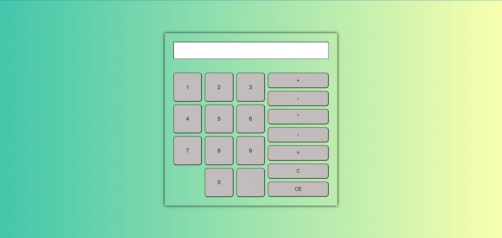
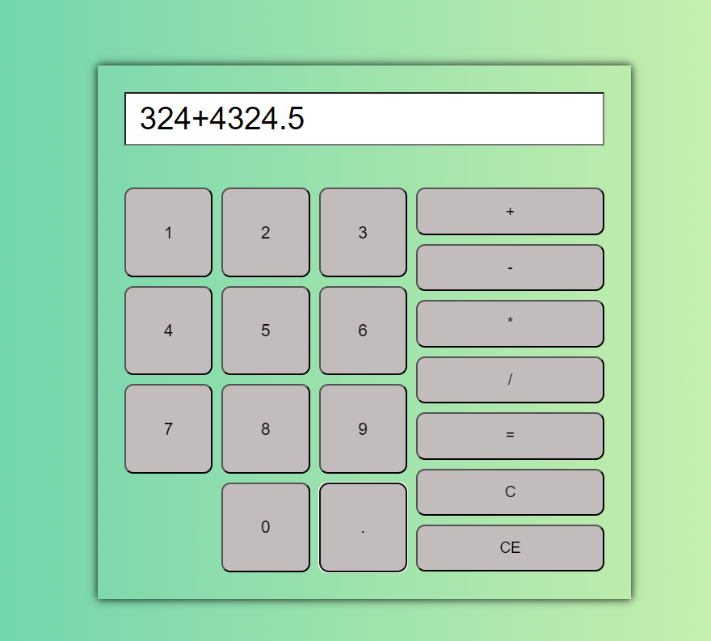
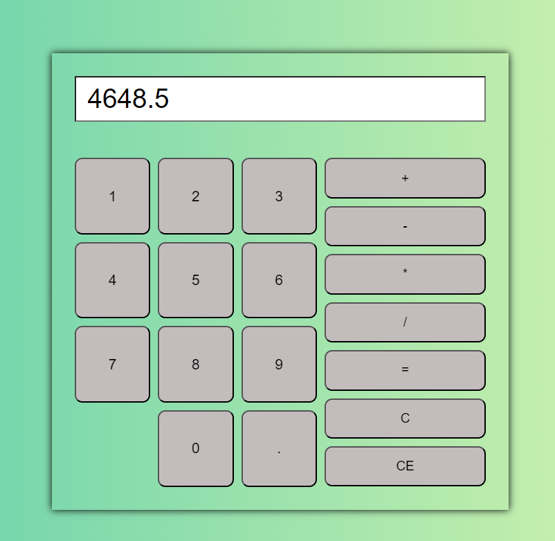

## A Calculator made using pure HTML, CSS, JS

#### Main UI

#### Addition Operation

#### Output

### This app allows all the given operations : addition, subtraction, multiplication and division in both integer and decimal point format 
### You also have operations such as clear one digit and clear everything
### Calculator can also be operated with buttons and keyboard